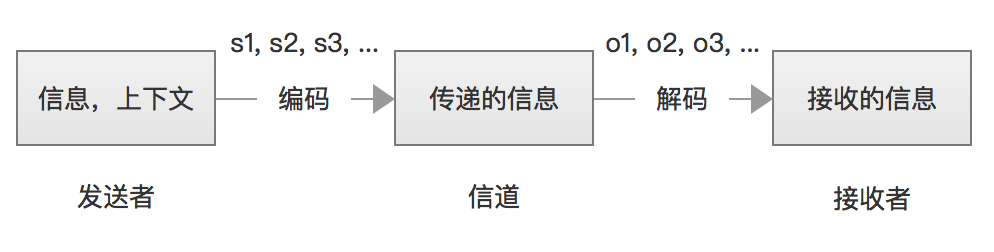

# HMM
一个通信模型可以表示为：

其中s1,s2,s3,...是信号源发出的信号，o1,o2,o3,...是接收器接收到的信号。通信中的`解码`就是根据接收到的信号o1,o2,o3,...还原出发送的信号s1,s2,s3,...。

几乎所有的自然语言处理问题都可以等价于通信的解码问题。

> 一些前置概念：

**随机过程**：对随机变量的时间序列s1,s2,s3,...的研究。

**马尔可夫假设**：随机过程中的各个状态$S_t$的概率分布只与它前一个状态$S_{t-1}$有关，即$P(s_t|s_1,s_2,s_3,...,s_{t-1})=P(s_t|s_{t-1})$

**马尔可夫链**：符合马尔科夫假设的随机过程称为`马尔可夫过程`，也称为`马尔可夫链`。马尔可夫过程包括三个部分：状态，初始向量(初始时的状态概率)，状态转移矩阵。

> 真正的定义可以引出了：

**隐含马尔可夫模型(Hidden Markov Model)**：是`马尔可夫链`的一个扩展：任一时刻t的状态$s_t$是不可见的，但受状态影响的某些变量$o_t$则是可见的。其难点是从可观察的参数中确定该过程的隐含参数。HMM包括三个假设：
- 假设1：马尔可夫假设：状态构成一阶马尔可夫链。
- 假设2：不动性假设：状态与具体的时间无关。
- 假设3：输出独立性假设：输出$o_t$仅与当前状态$s_t$相关。

## HMM模型的应用
隐含马尔可夫模型最早的成功应用是语音识别。

## HMM模型的训练
隐含马尔可夫模型是机器学习的主要工具之一，和几乎所有的机器学习的模型工具一样，它需要一个训练算法（无监督：鲍姆-韦尔奇算法，有监督：基于人工标记的极大似然估计计算概率）和使用时的解码算法（维特比算法）。

### Baum-Welch算法

# CRF
在`CRF`中，定义一个特征函数集合，然后使用这个特征集合为标注序列进行打分，据此选出最靠谱的标注序列。该序列的分值是通过综合考虑特征集合中的函数得出的。 

# Viterbi算法

# CRF和HMM的对比

